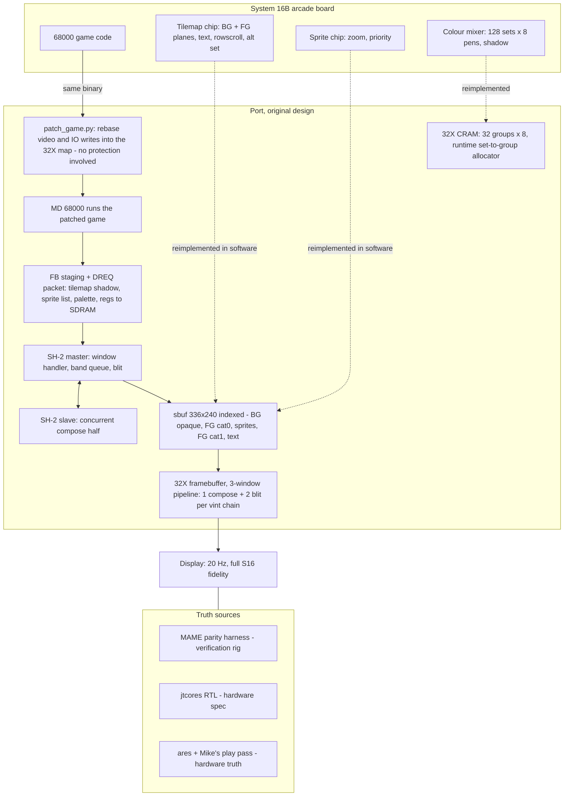
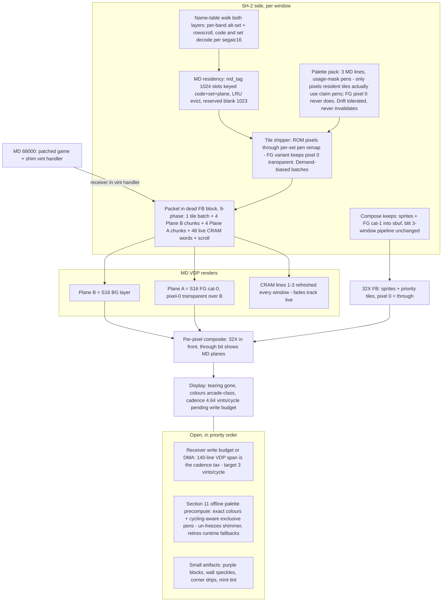

# Design flow — System 16 on the 32X, from first design to current

Three diagrams: the original software-compose design, what measurement
did to it, and the two-plane architecture running today. Companion to
ARCHITECTURE.md (facts and numbers live there); this is the shape of
the decisions.

## 1. Original design — the SH-2s ARE the video chip

The arcade board is four chips working per-scanline; the port's first
architecture replaced all of the video silicon with software on the two
SH-2s, using MAME's segaic16 source as the behavioural reference and
jtcores RTL as the hardware spec.

## 2. What measurement did to that design

Every box below is a measured result, not an opinion; the dead ends are
recorded with their killing numbers in LOOP*.md NEGATIVE RESULTS.

```mermaid
flowchart TD
    START["Software compose ships at 20 Hz with green tearing"]
    FLOOR["MEASURED: blit is bus-bound - 13.6 cyc/longword, write buffer buys nothing, 28.5 of 38 vblank lines. Framerate is a wall, not a bug"]
    TEAR["MEASURED: blit skips 23.4% of cycles = the green tearing"]

    START --> FLOOR
    START --> TEAR

    subgraph DEAD["Dead ends - do not re-attempt"]
        IDLE["Chaotix idle-token: premise is a parked SH-2, ours is saturated - cadence 3.03 to 7.48"]
        CMDINT["Interrupt pickup: deferrals 4.6x, skips 66% - ISR cost alone 3.1 points"]
        DIRTY["Dirty-row blit: only 31.8% transparent vs 25% break-even"]
        DMAC["DMAC blit: 1.77x SLOWER on ares"]
    end
    FLOOR --> DEAD

    PIVOT["PIVOT DECISION: stop redrawing what dedicated silicon can draw - move the tile planes onto the MD VDP, keep sprites + priority tiles on the SH-2s. Evidence: the commercial library did it this way"]
    TEAR --> PIVOT
    DEAD --> PIVOT

    subgraph SLICES["Pivot slices, each verified before the next"]
        S1A["1a: MD video composites through the 32X layer - through bit = CRAM entry bit 15, was never armed"]
        S1B["1b: real tiles reach MD VRAM via a self-describing packet in dead FB space - idempotence is load-bearing"]
        S1C["1c: name tables from the real tilemap, per-band alt-set and rowscroll selection, hardware scroll"]
    end
    PIVOT --> S1A --> S1B --> S1C

    subgraph BUGS["The archaeology 1c uncovered"]
        PALSH["Tag arrays placed inside PAL_SH - palette stream clobbered them every batch"]
        MSHORT["-mshort: constant-only VDP commands shifted left 16 evaluate to ZERO - silent null commands"]
        EVICT["First-come residency dies on the title: 1120 cycling codes vs 1024 slots - LRU eviction required"]
        VOID["The 'void' was never a render bug: the graveyard wall and trees are the FG LAYER, and removing the slave's software compose removed FG cat-0's last renderer"]
        SEQ["Instrument lessons: fake videoram space, dying write taps, timeline drift across builds - anchor by game state, trust the WIP-commit clock"]
    end
    S1C --> BUGS

    PAYOFF["MEASURED PAYOFF: blit skips 23.4% to 0.2% - tearing killed. Framerate unchanged - known and accepted. Cost: receiver spans 140 scanlines, ares cadence 4.64 vints/cycle"]
    BUGS --> PAYOFF
```

## 3. Current design — two-plane hybrid

The MD VDP draws what it is good at (two scroll planes); the SH-2s draw
what only they can (zoomed sprites, priority tiles); the 32X composite
stitches them per pixel via the through bit.

The through-line of the whole project: **every box that survived did so
by measurement** — the original design fell to numbers, not taste, and
the pivot's slices each carried their own verification before the next
was built. The toolkit deliverable (TOOLKIT.md) inherits the pieces
that are game-agnostic: the packet transport, the residency allocator,
the palette pack, the parity and capture instruments, and the
negative-results ledger that keeps the next title from re-walking this
map.
